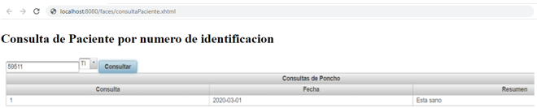

## Escuela Colombiana de Ingeniería

### PDSW – Procesos de desarrollo de Software
### Parcial Segundo Tercio

**IMPORTANTE**

* Deseable Trabajar en Linux (para evitar problemas con las instrucciones finales).
* Se puede consultar en la Web: APIs/Documentación de lenguaje y frameworks (Primefaces, Guice, MyBatis, etc), y enunciados de los laboratorios (se pueden revisar los fuentes incluidos con los dichos enunciados).
* No se permite: Usar memorias USB, acceder a redes sociales, clientes de correo, o sistemas de almacenamiento en la nube (Google Drive, DropBox, etc). El uso de éstos implicará anulación.
* Clone el proyecto con GIT, NO lo descargue directamente.
* NO modifique los indicado en consultaPaciente.xhtml.
* El filtrado y ordenamiento de los datos DEBE realizarse en el motor de base de datos, a través del uso de SQL. Consultar todos los datos y filtrarlos en el servidor de aplicaciones -que es supremamente INEFICIENTE- se evaluará como INCORRECTO.

## A partir de la aplicación base suministrada, debe realizar lo siguiente:

Dado un número y tipo de identificacion de un paciente, mostrar el paciente y las consultas que ha realizado esde paciente.

Mostrar los pacientes menores de edad que en sus consultas se encuentren las enfermedades: hepatitis o varicela.

1. (20%) A partir de la especificación hecha en los métodos
    *consultarPacientesPorId* y *consultarMenoresConEnfermedadContagiosa* de la fachada de
    servicios (la parte lógica de la aplicación), implemente sólo una prueba (la que considere más importante para validar las especificaciones y los criterios de aceptación). Siga el esquema usado en ServicesJUnitTest para poblar la base de datos volátil y verificar el comportamiento de las operaciones de la lógica.

   
   

3. (40%) Implemente la historia de usuario #1, agregando todo lo que haga falta en la capa de presentación, lógica y de persistencia. La vista debe implementarse en consultaPaciente.xhtml.
   
4. (40%)Implemente la historia de usuario #2, agregando todo lo que haga falta en la capa de presentación, lógica y de persistencia. La vista debe implementarse en consultarMenoresEnfermedadContagiosa.xhtml.

   

