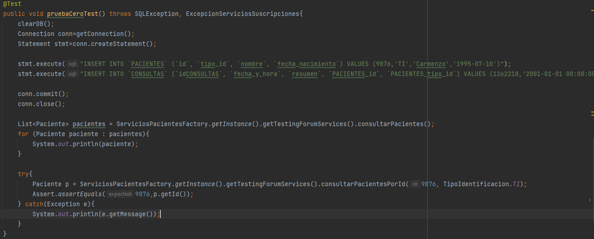

## Escuela Colombiana de Ingeniería

### PDSW – Procesos de desarrollo de Software
### Parcial Segundo Tercio

**IMPORTANTE**

* Deseable Trabajar en Linux (para evitar problemas con las instrucciones finales).
* Se puede consultar en la Web: APIs/Documentación de lenguaje y frameworks (Primefaces, Guice, MyBatis, etc), y enunciados de los laboratorios (se pueden revisar los fuentes incluidos con los dichos enunciados).
* No se permite: Usar memorias USB, acceder a redes sociales, clientes de correo, o sistemas de almacenamiento en la nube (Google Drive, DropBox, etc). El uso de éstos implicará anulación.
* Clone el proyecto con GIT, NO lo descargue directamente.
* NO modifique los indicado en consultaPaciente.xhtml.
* El filtrado y ordenamiento de los datos DEBE realizarse en el motor de base de datos, a través del uso de SQL. Consultar todos los datos y filtrarlos en el servidor de aplicaciones -que es supremamente INEFICIENTE- se evaluará como INCORRECTO.

## A partir de la aplicación base suministrada, debe realizar lo siguiente:

Dado un número y tipo de identificacion de un paciente, mostrar el paciente y las consultas que ha realizado esde paciente.

Mostrar los pacientes menores de edad que en sus consultas se encuentren las enfermedades: hepatitis o varicela.

## Antes de comenzar
* clonamos el proyecto indicado para manejarlo en nuestro entorno local.

ahorra despues de trabajar en el proyecto se va a realizar el readme que es el que se 
va a calificar y toca creear en nuestra cuentas un nuevo pryecto

luego empezamos a realizar el parcial, toca primero crear los atributos en la case de
PacientesBean con todos los atributos y funciones basicas que lleguemos a necesitar para el desarollo del 
parcial

## Puntos Parciales
1. (20%) A partir de la especificación hecha en los métodos
    *consultarPacientesPorId* y *consultarMenoresConEnfermedadContagiosa* de la fachada de
    servicios (la parte lógica de la aplicación), implemente sólo una prueba (la que considere más importante para validar las especificaciones y los criterios de aceptación). Siga el esquema usado en ServicesJUnitTest para poblar la base de datos volátil y verificar el comportamiento de las operaciones de la lógica.

Ahorra vemos la prueba desarollada este fue el segundo punto realizado ya que primero se realizao
todo el segundo punto, esto fue para que despues pudieramos correr la prueba y verificar que
pasara, despues de la foto de la prueba en si podemos ver como en la siguiente imagen corre y pasa
la prueba realizada con lo que nos da confianza que la logica realizada para este parcial esta correcta
y ya cuando modificamos las cosas esta prueba nos va a indicar que no hemos dañado el codigo

Un punto importante sobre las pruebas es queal principio no funcionaba porque no enontraba 
las tablas de la base de datos, para solucionar este problema toco en inteligent decir que construñera el 
codigo, y volver a compilar el codigo y luego si correr las pruebas, con esto nos da el resultado
de la segunda imagen que podemos ver

   
   

2. (40%) Implemente la historia de usuario #1, agregando todo lo que haga falta en la capa de presentación, lógica y de persistencia. La vista debe implementarse en consultaPaciente.xhtml.

esta es la historia de usuario #1 
    

ahorra empezamos a desarollar el codigo para poder cumplir con la funcionalidad requerida
primero empezamos cambiando la funcion de consultarPacientePorId que lo encontramos en la clase
PacientesBean

luego vamos a ServiciosPacienteImpl y agregamos la funcion

Despues vamos a MyBatisDAOPaciente y modificamos la funcion de load() que como podemos 
ver en imagenes anteriores la estamos utilizando

Siguiendo con el parcial toca ahorra irese a PacienteMapper.xml y configurarlo, es donde
colocamos la consulta

pero tambien toca en el mismo archivo donde vamos trabajando, toca agregar el resultmap,
ya que esto se utiliza para llenar parametros de la clase

por ultimo toca tambien agragar el resultmap de las consultas

luego de haber realizado esto nos vamos al archivo consultaPaciente.xhtml que es 
la pagina en si y la configuramos a nuestro antojo y configuramos el boton de 
consulta, para que utilice la funcion desarollada

Aqui surgio un error que toco investigar y preguntar ya que no estaba tomando el 
parametro de id, lo tenia en cuenta como vacio nulo, por lo que es importante que en PacienteMapper
pongamos lo siguiente parametros con los mismos nombres de la consulta, para que 
agare los valores y no los tome como nulos.

Aqui podemos ver el resultado de la pagina y de la consulta realizada, esto lo realizamos
lanzando y empezando el servicio de tomcat podemos ver el resultado

3. (40%)Implemente la historia de usuario #2, agregando todo lo que haga falta en la capa de presentación, lógica y de persistencia. La vista debe implementarse en consultarMenoresEnfermedadContagiosa.xhtml.

esta es la historia de usuario#2

aqui como en el anterior punto vemos como tambien empezamos con la parte de la logica
modificandos las funcion en PacientesBean, ademas de la funcion que nos da el parcial
toca crear otra que nos devuelva los menores contagiados

luego vamos a ir a ServiciosPacienteImpl y agregamos la funcion que sobreescribe la ya
escrita

luego igual que en el punto anterior vamos a ir a MyBatisDAOPaciente y agregar una funcion 
que como vemos esta utilizando el metodo en la foro de arriba

luego vamos a DaoPaciente y implementamos la funcion de de loadmenorescontagios

como vemos el metodo de arriba esta utilizando una funcion de menores contagioso
que toca implementrala en PacienteMapper

Despues de terminar con eso vemos como toca ir a pacienteMapper.xml y agregar a ahorra 
la consulta que vamos a realizar de los menores contagiados

es importante mencionar que igual que en el anterior punte este igual usa los resultmap
ya hechos para el anterior punto

luego igual que en el anterior punto toca entrar a consultarMenoresEnfermedadContagiosa.xhtml
y configurar la pagina web, asi como su boton de consultar

luego con el servicio de tomcat corrriendo verificamos como quedo la pagina web 

## FIN

para acabar con este laboratorio vemos que tenemos todo en nuestro entorno local
toca subir todo lo realizado a github, para que este pueda ser evaluado

